  

 

##  &nbsp; `01` The developer behind the code

<table>
<tr>
<td width="58%" valign="top">
<h3>Models. Interfaces. Real-world systems.</h3>

I'm <b>Yashraj Pahuja</b>, a software developer at <b>Growth Twin Technologies</b>, building across applied AI, full-stack engineering, and connected devices.

I work on the entire path from a model's prediction to a useful product: <b>data pipelines, APIs, web interfaces, and embedded hardware</b>.

<b>Currently building</b> GrowthCharters — AI career intelligence powered by NLP, LLMs, and agentic AI.

<b>Currently studying</b> B.Tech CSE (AI &amp; ML), K.R. Mangalam University. Minor in AI &amp; Data Science, IIT Indore.

</td>
<td width="42%" valign="middle" align="center">

</td>
</tr>
</table>

<table>
<tr>
<td width="25%" align="center"><h3>85%+</h3>EEG CLASSIFICATION</td>
<td width="25%" align="center"><h3>100+</h3>FACULTY SERVED</td>
<td width="25%" align="center"><h3>3</h3>HACKATHON AWARDS</td>
<td width="25%" align="center"><h3>50+</h3>WORKSHOP LEARNERS</td>
</tr>
</table>

##  &nbsp; `02` Where I build

<table>
<tr>
<td colspan="2" valign="top">
<h3> Software Developer · Growth Twin Technologies</h3>

Building AI backend systems with <b>microservices architecture</b>, coordinated AI workflows, and integrations across <b>n8n, RAG pipelines, and LLMs</b>.

   
</td>
</tr>
<tr>
<td width="50%" valign="top">
<h3> ML Research Intern</h3>
<b>IFMR GSB, Krea University</b> JUN – AUG 2025 · REMOTE

Developed EEG emotion recognition on <b>SEED-IV</b>, achieving <b>85%+ classification accuracy</b>. Preprocessed <b>10,000+ samples</b> and engineered <b>20+ frequency-domain features</b>.

  
</td>
<td width="50%" valign="top">
<h3> Web Development Intern</h3>
<b>ASA NeedCFO Finvisors</b> JUN – JUL 2025 · REMOTE

Designed and deployed the corporate website with React and Node.js. Improved architecture to reduce <b>page load time by 30%</b>, with reported <b>99% uptime</b>.

 
</td>
</tr>
</table>

##  &nbsp; `03` Things I’ve built

<table>
<tr>
<td colspan="2" valign="top">
<h3> GrowthCharters</h3>
FLAGSHIP · AI CAREER INTELLIGENCE

AI that predicts <b>industry fit</b>, maps <b>skill gaps</b>, and recommends <b>personalized learning paths</b> using NLP, LLMs, and agentic AI.

   
</td>
</tr>
<tr>
<td width="50%" valign="top">
<h3> <a href="https://github.com/CYBORG-YASHRAJ/pill-dose-buddy">PillDoseBuddy ↗</a></h3>
AI + IOT · CONNECTED HEALTHCARE

Smart medicine dispenser with real-time Firebase sync, medication alerts, and NLP voice control. Built for <b>20+ users</b> with <b>90% voice-control accuracy</b>.

  
</td>
<td width="50%" valign="top">
<h3> <a href="https://itme.krmangalam.edu.in">ITME Academic Journal ↗</a></h3>
ACADEMIC PUBLISHING · KRMU

Authentication, peer review, and automated editorial alerts. Reduced editorial time by <b>35%</b> for <b>100+ faculty members</b>.

  
</td>
</tr>
<tr>
<td width="50%" valign="top">
<h3> <a href="https://ideas.krmangalam.edu.in">IDEAS 3.0 ↗</a></h3>
UNIVERSITY INNOVATION PLATFORM

Connects <b>student innovators, academia, and industry</b> to support collaboration and real-world opportunities.

  
</td>
<td width="50%" valign="top">
<h3> EcoCred</h3>
IN DEVELOPMENT · INTELLIGENT RECYCLING

Exploring AI-assisted waste recognition and recycling rewards with <b>embedded cameras, computer vision, and a mobile interface</b>.

  
</td>
</tr>
</table>

##  &nbsp; `04` The stack behind the work

<table>
<tr>
<td width="50%" valign="top">
<h3> Languages</h3>

Python · TypeScript · JavaScript · Java · C++ · SQL

</td>
<td width="50%" valign="top">
<h3> AI &amp; machine learning</h3>

Pandas · NumPy · NLP · LLMs · RAG · Agentic AI

</td>
</tr>
<tr>
<td width="50%" valign="top">
<h3> Web &amp; APIs</h3>

Interfaces · Backend architecture · REST APIs

</td>
<td width="50%" valign="top">
<h3> Databases</h3>

Relational data · Documents · Real-time sync

</td>
</tr>
<tr>
<td width="50%" valign="top">
<h3> Cloud &amp; delivery</h3>

AWS EC2 / S3 · CI/CD · Deployment workflows

</td>
<td width="50%" valign="top">
<h3> Hardware &amp; automation</h3>

  

Connected devices · Bluetooth LE · Workflow automation

</td>
</tr>
</table>

##  &nbsp; `05` Beyond the commits

<table>
<tr>
<td width="33%" align="center">

<h3>Vihaan 8.0</h3><b>Winner</b>
₹10,000

</td>
<td width="33%" align="center">

<h3>Hackemon</h3><b>Second prize</b>
₹40,000

</td>
<td width="33%" align="center">

<h3>RoboRush</h3><b>Second prize</b>
₹3,000

</td>
</tr>
</table>

**Education** — B.Tech CSE (AI & ML), K.R. Mangalam University · Expected May 2028 · **9.45 / 10 CGPA, Dean’s Honor List**. Minor in AI & Data Science at IIT Indore, ongoing.

**Credentials** — Neo4j Certified Database Engineer · Google Cloud Skills Boost — Cloud Specialist Trainee.

**Community** — Led AI and web development workshops for **50+ students** at TechSphere 2025. Organized **Hack4Kaggle**, KRMU's inaugural Kaggle competition, and served as lead organizer for **Intellithon'26**.

##  &nbsp; `06` GitHub stats report

  

<a href="https://github.com/CYBORG-YASHRAJ?tab=repositories">View repositories ↗</a> &nbsp;·&nbsp; <a href="https://github.com/CYBORG-YASHRAJ?tab=overview">View contributions ↗</a>

  

From public GitHub data · refreshed daily by GitHub Actions · original repo languages exclude forks

---

### From an idea to something you can use.

AI systems, full-stack products, and hardware that talks to software.

  

YASHRAJ PAHUJA &nbsp; / &nbsp; GURUGRAM, INDIA &nbsp; / &nbsp; CYBORG-YASHRAJ

